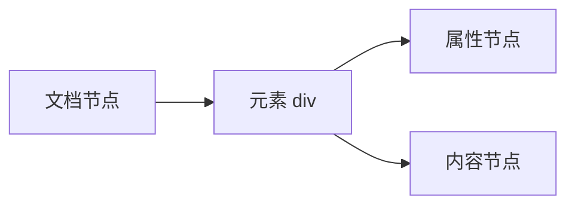
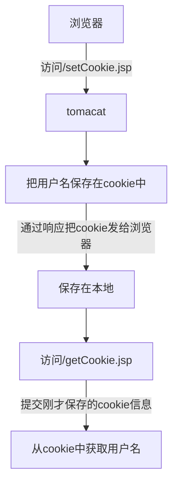

# JSON语法
+ 创建JSON对象：var timo ={"name":"timo","hp"=600};
名称要用括号，名称和值用冒号隔开。
+ 访问JSON 对象属性：
document.write("timo.name");
+ 创建JSON数组：
```JSON
var heros={
	{"name"="","hp"=};
	{};
	...
}
```
+ 访问JSON数组：下标
+ JSON对象和JavaScript对象：
JavaScript分内置对象和自定义对象，JSON就是自定义对象，只不过以JSON 的数据组织形式表达出来。
+ 字符串转为JSON对象：
字符串拼接得到一个JSON结构的字符串，并不是JSON对象。需要通过eval转换得到。转换时候注意eval函数要以（开头，）结尾。或者使用JQurey的$parseJSON转换函数：
```JSON
var gareen = eval("("+s3+")");
or
var gareen = $.parseJSON(s3);
```
+ JSON对象转换为字符串：
直接打印JSON对象看不见内容，需要通过JSON.stringify函数把它转换为字符串。
```JSON
var heroString = JSON.stringify(hero)
```
# JavaScript

## 语言基础
+ 放在script标签中，一旦加载，就会执行。多段代码，从上到下，顺序执行。
+ 放在外部文件中，在html中引用
+ var声明可有可无
+ 变量命名可$\_和字母 
+ 调试法：
	+ alart调试
	+ 浏览器自带，F12过后按F5刷新可以看见报错信息。(CTRL+R)
	+ console.log
+ 用typeof判断变量类型
+ 变量都有toString方法，转换为数字，转换为boolean
## 对象
数组 对象... ...
## BOM

+ Window
+ Navigator
+ Screen
+ History
+ Location
+ 弹出框
+ 计时器
都是调用现成方法，用到再看，好像不怎么需要，能看懂就行。
# HTML DOM
文档对象模型：DOM把所有的html都转换为节点。把html里面的各种数据当作对象进行操作的一种思路。整个文档是一个节点，所有元素也是节点。

# AJAX
在界面进行异步刷新
主要是通过创建XMR(XMLHttpRequest)来悄悄地和服务器进行交互
1. 创建XHR对象
2. 设置响应函数
3. 设置要访问的页面
4. 发出请求
5. 当服务端的响应返回，响应函数被调用。
6. 在响应函数中，判断响应是否成功，如果成功获取服务端返回的文本
# JSP
## Hello JSP
在servlet开发中，可以在html中直接写java代码 用<% , %>包裹java代码
```JSP
<%@page contentType="text/html; charset=UTF-8"  pageEncoding="UTF-8" import="java.util.*"%>
<%=new Date().toLocaleString()%>
```
+ <%@page 固定指令 <%= 页面输出指令
+ JSP被转译成了Servlet，所有JSP可以在html中运行java代码
## JSP 执行过程
jsp先转译java，再编译程class，执行该文件，生成html，最后通过http协议把html响应返回给浏览器。
## JSP 页面元素

+ 静态内容就是html,css,js等
+ 指令\<%@开始， %>结束
+ 表达式<%=%>用于输出一段html
+ Scriptlet在<%%>之间，可以写任何java代码
+ 动作 <jsp:include page="Filename">在jsp页面中包含另一个页面。
+ 注释<%-- --%>不同于html的<!-- -->，这个注释浏览器也看不到。
## JSP include
## JSP 跳转

## JSP cookie
由服务器端创建，但是不会保存在服务器，浏览器保存在用户本地。下一次访问网站的时候，把该cookie发送给服务器。
setCookie.jsp/getCookie.jsp


## JSP session
+ session是一个盒子，一个从开始访问网站就不会变更的会话，直到关闭浏览器为止。
+ session有有效期，在web.xml里面配置
+ setSession.jsp/getSession.jsp
保存数据的 方式类似MAP，键值对。
+ session和cookie的关系就像盒子和钥匙。
## JSP 作用域
##  JSP 隐式对象
## JSP JSTL
## JSP EL表达式语言


